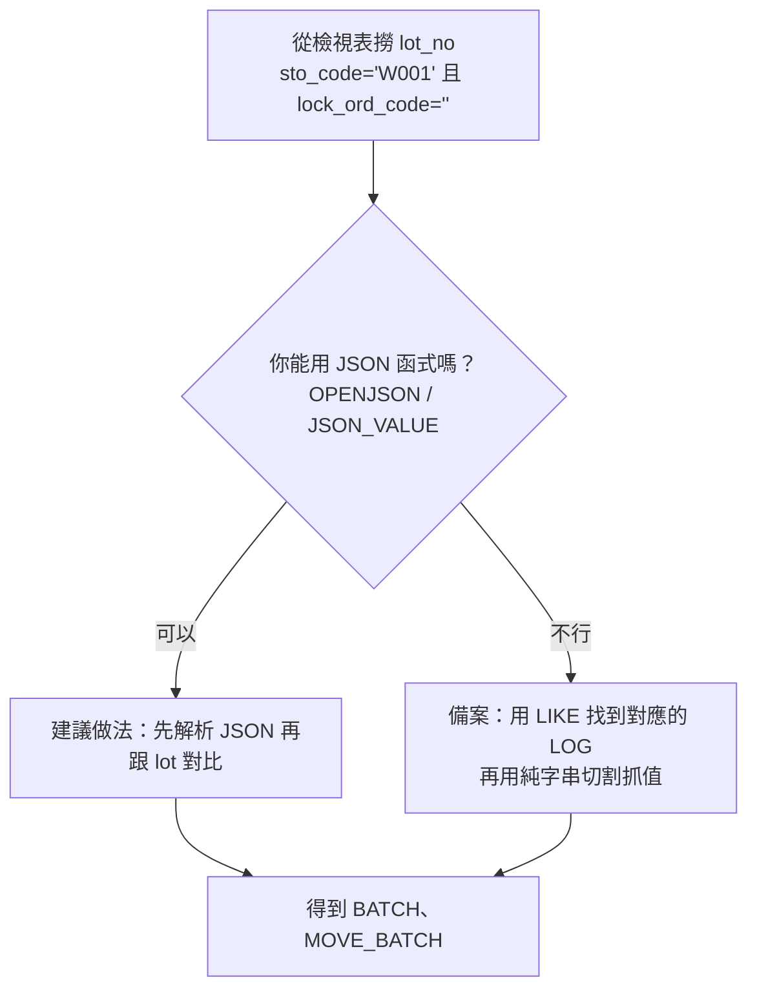

# MSSQL 2022：用最簡單的方法找出 BATCH / MOVE\_BATCH（給 12 歲也看得懂）

> 目標：從**訂單庫存檢視表**拿到 `lot_no`，去**LOG 紀錄**裡找對應那筆 JSON，最後把裡面的 `BATCH` 和 `MOVE_BATCH` 抓出來。

***

## 你要做的三件事

1. **先拿到要查的 lot 清單**（在檢視表 `v_STO_QTY_PRO_LOT_EXP_ORD`）。
2. **到 LOG 表 `LOG01_0000` 找到有這個 lot 的 JSON**（欄位：`api_parameter_input2`）。
3. **把 JSON 裡的 `BATCH` / `MOVE_BATCH` 拆出來**。

> 小提醒：`sto_code` 固定用 `W001`，`lock_ord_code` 要是空字串 `''` 才算沒被鎖住。

***

## 流程圖（一眼就懂）



***

## 方法一（**建議**）：解析 JSON 再比對 lot（更準）

> 優點：不會誤抓其他文字、可處理多筆 `T_ITEM`。\
> 需要：SQL Server JSON 函式（`OPENJSON`/`JSON_VALUE`），**資料庫相容性層級 ≥ 130**（SQL 2022 推薦 160）。

```sql
-- 1) 撈出要查的 lot 清單
;WITH lots AS (
    SELECT DISTINCT LTRIM(RTRIM(lot_no)) AS lot_no
    FROM v_STO_QTY_PRO_LOT_EXP_ORD
    WHERE sto_code = 'W001'
      AND ISNULL(lock_ord_code, '') = ''
      AND NULLIF(LTRIM(RTRIM(lot_no)), '') IS NOT NULL
),
-- 2) 解析 LOG 裡的 JSON，展開 T_ITEM 陣列
parsed AS (
    SELECT
        [主鍵ID] = l.log01_0000,  -- 需要可保留，不需要可刪
        JSON_VALUE(j.value, '$.BATCH')      AS batch_no
      , JSON_VALUE(j.value, '$.MOVE_BATCH') AS move_batch_no
    FROM LOG01_0000 AS l
    CROSS APPLY OPENJSON(CAST(l.api_parameter_input2 AS nvarchar(max)), '$.T_ITEM') AS j
    WHERE ISJSON(CAST(l.api_parameter_input2 AS nvarchar(max))) = 1
)
-- 3) 把解析到的 batch 和 move_batch 跟 lot 清單比對
SELECT DISTINCT p.batch_no AS BATCH, p.move_batch_no AS MOVE_BATCH
FROM parsed AS p
JOIN lots   AS t
  ON t.lot_no = p.batch_no
  OR t.lot_no = p.move_batch_no;
```

***

## 方法二（可用但較粗）：先 LIKE 命中，再解析 JSON

> 優點：容易理解。缺點：可能誤中（因為只是用字串包含 `LIKE '%lot%'`）。

```sql
;WITH lots AS (
    SELECT DISTINCT LTRIM(RTRIM(lot_no)) AS lot_no
    FROM v_STO_QTY_PRO_LOT_EXP_ORD
    WHERE sto_code = 'W001'
      AND ISNULL(lock_ord_code, '') = ''
      AND NULLIF(LTRIM(RTRIM(lot_no)), '') IS NOT NULL
)
SELECT DISTINCT
    JSON_VALUE(j.value, '$.BATCH')      AS BATCH,
    JSON_VALUE(j.value, '$.MOVE_BATCH') AS MOVE_BATCH
FROM lots AS t
JOIN LOG01_0000 AS l
  ON CAST(l.api_parameter_input2 AS nvarchar(max)) LIKE N'%' + t.lot_no + N'%'
CROSS APPLY OPENJSON(CAST(l.api_parameter_input2 AS nvarchar(max)), '$.T_ITEM') AS j
WHERE ISJSON(CAST(l.api_parameter_input2 AS nvarchar(max))) = 1;
```

***

## 如果跑出錯誤？這樣處理

### 1) `無效的物件名稱 'OPENJSON'。`

代表資料庫把 `OPENJSON` 當成表名，因為**相容性層級太低**。\
先**查看**，再請有權限的人**調整**：

```sql
-- 查看目前相容性層級
SELECT name, compatibility_level
FROM sys.databases
WHERE name = DB_NAME();

-- 需要 DBA 權限：把目前資料庫調到 160 (SQL Server 2022)
ALTER DATABASE CURRENT SET COMPATIBILITY_LEVEL = 160;
```

### 2) `接近 '$.BATCH' 之處的語法不正確。`

多半是 `OPENJSON ... WITH (...)` 那種寫法解析失敗。\
**改用 `JSON_VALUE(j.value, '$.欄位')`**（上面的兩個方法就是這樣寫）通常就好了。

### 3) `接近關鍵字 'CROSS' 之處的語法不正確。`

`CROSS APPLY` 要放在 `FROM`/`JOIN` 後、`WHERE` 前。\
把順序調對就好（上面範例已正確）。

### 4) `接近 'WITH' 的語法不正確 … 前一個陳述式必須以分號結束。`

你在用 CTE（`WITH ... AS`）前一行沒加分號。\
**在 CTE 前面加 `;`** 開頭（上面範例一律 `;WITH`）。

***

## 不能用 JSON 函式？這個「急救版」先用著

> 當你**暫時無法**調整相容性層級時，用**純字串切割**抓第一個 `BATCH` / `MOVE_BATCH`。\
> 缺點：較脆弱（如果 JSON 排版變動、或 `T_ITEM` 多筆，可能需要調整）。

```sql
;WITH lots AS (
    SELECT DISTINCT LTRIM(RTRIM(lot_no)) AS lot_no
    FROM v_STO_QTY_PRO_LOT_EXP_ORD
    WHERE sto_code = 'W001'
      AND ISNULL(lock_ord_code, '') = ''
      AND NULLIF(LTRIM(RTRIM(lot_no)), '') IS NOT NULL
),
logs AS (
    SELECT
        l.log01_0000,
        js = CAST(l.api_parameter_input2 AS nvarchar(max))
    FROM LOG01_0000 l
    WHERE l.api_parameter_input2 IS NOT NULL
),
parsed AS (
    SELECT
        log01_0000,
        -- 取第一個 "BATCH":"...":
        BATCH =
        CASE WHEN CHARINDEX('"BATCH"', js) > 0
             THEN
                SUBSTRING(
                    js,
                    CHARINDEX('"', js, CHARINDEX(':', js, CHARINDEX('"BATCH"', js))) + 1,
                    CHARINDEX('"', js, CHARINDEX('"', js, CHARINDEX(':', js, CHARINDEX('"BATCH"', js))) + 1)
                      - (CHARINDEX('"', js, CHARINDEX(':', js, CHARINDEX('"BATCH"', js))) + 1)
                )
             ELSE NULL
        END,
        -- 取第一個 "MOVE_BATCH":"...":
        MOVE_BATCH =
        CASE WHEN CHARINDEX('"MOVE_BATCH"', js) > 0
             THEN
                SUBSTRING(
                    js,
                    CHARINDEX('"', js, CHARINDEX(':', js, CHARINDEX('"MOVE_BATCH"', js))) + 1,
                    CHARINDEX('"', js, CHARINDEX('"', js, CHARINDEX(':', js, CHARINDEX('"MOVE_BATCH"', js))) + 1)
                      - (CHARINDEX('"', js, CHARINDEX(':', js, CHARINDEX('"MOVE_BATCH"', js))) + 1)
                )
             ELSE NULL
        END
    FROM logs
)
SELECT DISTINCT p.BATCH, p.MOVE_BATCH
FROM parsed AS p
JOIN lots   AS t
  ON t.lot_no = p.BATCH
  OR t.lot_no = p.MOVE_BATCH;
```

> 之後**有空一定要升級**相容性層級，回到「方法一 / 方法二」，比較穩、也比較快。

***

## 小辭典（超短）

* **lot\_no**：像產品的「箱號 / 批號」。
* **LOG01\_0000**：記錄每次異動時送到 API 的資料（JSON）。
* **`BATCH` / `MOVE_BATCH`**：JSON 中的兩個欄位，分別代表來源批號、要移到的批號。
* **JSON**：長得像 `{ "key":"value" }` 的文字格式。
* **相容性層級**：資料庫的一個設定。數字越新，支援的語法越多（例如 JSON 函式）。

***

## 我應該用哪一個方法？

| 情況                            | 建議用法              |
| ----------------------------- | ----------------- |
| 你能用 `OPENJSON` / `JSON_VALUE` | **方法一（建議）** 或 方法二 |
| 目前不能改資料庫設定                    | **急救版（純字串切割）**    |
| 擔心誤抓、想更準                      | **方法一**（先解析再比對）   |

***

## 附：最小測試範例（方便你練習）

把下面這段 JSON 貼到 SSMS 的欄位值裡時，你應該要抓到：

* `BATCH = 2505009877`
* `MOVE_BATCH = 2505007928`

```json
{
  "I_FCODE": "B01",
  "I_IMPNO": "04ZeDUNXv9uQs7",
  "I_GM_CODE": { "GM_CODE": "04" },
  "I_HEADER": { "PSTNG_DATE": "20250610", "DOC_DATE": "20250610" },
  "T_ITEM": [
    {
      "MATERIAL": "5012.02301.0002",
      "PLANT": "1100",
      "STGE_LOC": "W001",
      "BATCH": "2505009877",
      "SPEC_STOCK": "E",
      "MOVE_TYPE": "309",
      "ENTRY_QNT": "26.000000",
      "ENTRY_UOM": "PCS",
      "MOVE_MAT": "5012.02301.0002",
      "MOVE_PLANT": "1100",
      "MOVE_STLOC": "W001",
      "MOVE_BATCH": "2505007928",
      "SALES_ORD": "2100041855",
      "S_ORD_ITEM": "70",
      "VAL_SALES_ORD": "2100041855",
      "VAL_S_ORD_ITEM": "70"
    }
  ]
}
```

***

## 完成 🎉

* 你現在知道**去哪裡拿 lot**、**去哪裡找 JSON**、**怎麼拆出 BATCH / MOVE\_BATCH**。
* 出錯也不怕：**照著上面的對症處理**就能排除。
* 真的不行，就先用「急救版」，之後再升級相容性層級。

> 小小工程師也能做到！👏
