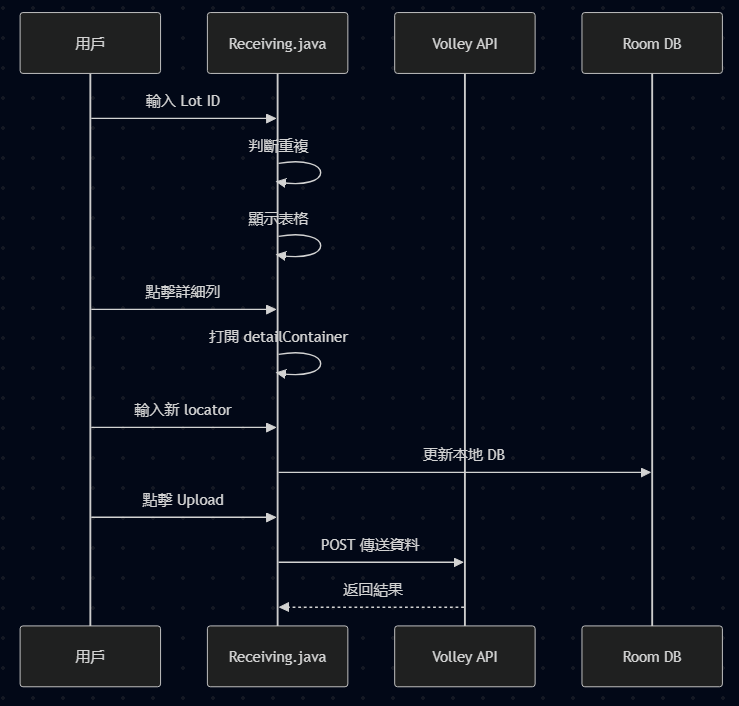
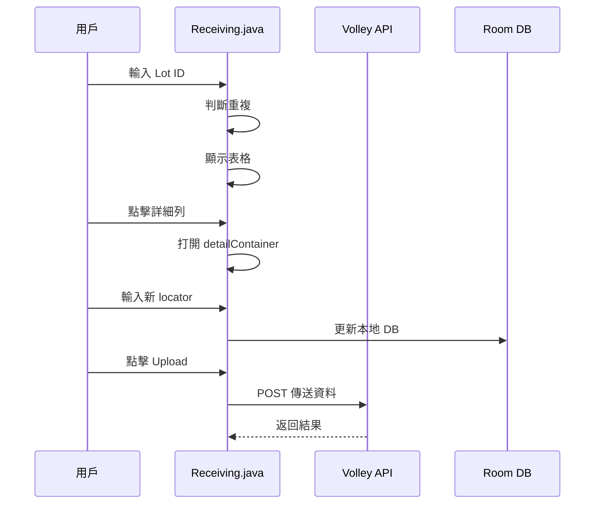

# 設計說明文件

這是 Android Studio 開發中一個用於倉儲系統數據接收的模組說明文件，給新接手的開發者或維護人員使用，配合 GitBook 使用 Markdown 格式整理。

***

## 🔍 檔案欄表

| 檔名                       | 精簡說明                           |
| ------------------------ | ------------------------------ |
| `Receiving.java`         | 主程式檔，負責 UI 監聽、數據處理、API 與 DB 交互 |
| `receiving_store_in.xml` | UI 介面設計檔，設定部件位置與樣式             |

***

## 🔺 UI 位置與操作說明

### ✏️ 1. Lot ID / Locator 輸入區

| ID        | 類型       | XML 行號 | Java 變數   | 功能                          |
| --------- | -------- | ------ | --------- | --------------------------- |
| `etLotId` | EditText | 22     | `etLotId` | 讓用戶輸入/掃描 Lot ID，可按 Enter 上傳 |

* 如果想變更外觀，請修改 `receiving_store_in.xml` 第 22 行
* 關聯 Java 方法：`etLotId.setOnEditorActionListener`

### 🔺 2. 表格顯示區

| ID             | 類型          | XML 行號 | Java                   | 功能             |
| -------------- | ----------- | ------ | ---------------------- | -------------- |
| `tableLayout`  | TableLayout | 41     | `tableLayout`          | 用於顯示輸入的 Lot 列表 |
| `tableScanned` | TableLayout | 139    | `renderScannedTable()` | 縮小表格，顯示掃描紀錄    |

* 日志格式和顏色在 Java `renderScannedTable()` 中設定

### 🔺 3. 詳細資料區 (Detail View)

| ID                | 類型           | XML 行號  | Java               | 功能               |
| ----------------- | ------------ | ------- | ------------------ | ---------------- |
| `detailContainer` | LinearLayout | 52\~147 | `showDetailView()` | 顯示分頁的細節資料        |
| `popupLotId`      | EditText     | 66      | `showDetailView()` | 顯示 Lot ID (無法編輯) |
| `popupQty`        | EditText     | 75      | -                  | 顯示 QTY           |
| `popupPartId`     | EditText     | 84      | -                  | 顯示 Part ID       |
| `popupSuggestion` | EditText     | 93      | -                  | 顯示建議 Locator     |
| `popupLocator`    | EditText     | 100     | `updateLocator()`  | 可輸入新的傳備位         |
| `btnCloseDetail`  | Button       | 108     | (未繼續啟用)            | 关閉詳細視圖           |

### 🔺 4. 功能按鈕

| ID          | 類型     | XML | Java 變數/方法                     | 功能            |
| ----------- | ------ | --- | ------------------------------ | ------------- |
| `btnUpload` | Button | 151 | `btnUpload.setOnClickListener` | 為傳送數據給 Server |
| `btnBack`   | Button | 158 | (未定義操作)                        | 退出機能          |

***

## 📈 Java 功能區塊說明

### ▶ onCreate()

* 設定所有 UI 控制項
* 設定 Enter 動作回變
* 定義 Volley queue

### ▶ renderScannedTable()

* 顯示一行行扮的 Lot ID
* 設定文字顏色、格式

### ▶ showDetailView(String\[] row)

* 顯示詳細區（打開 `detailContainer`）
* 填入 popup 欄位，唯有 `popupLocator` 可編輯

### ▶ updateLocator(...)

* 更新内部數據附加狀態 ("Y" or "N")
* 重新顯示表格

### ▶ updateReceivingData() / updateReceivingData\_byLoc()

* 使用 DAO 或 CommDao 方式更新 Room DB

### ▶ sendToServer()

* 利用 Volley 發送 POST 請求
* 為指定 server URL
* 成功後 Toast 提示，失敗時顯示 error

***

## ⚖️ 修改指南

| 修改目的       | 所在位置                                          |
| ---------- | --------------------------------------------- |
| 改變輸入欄精緻格式  | XML `etLotId` (22)                            |
| 新增顯示列      | Java `renderScannedTable()`                   |
| 變更 API 連線口 | Java `sendToServer()`                         |
| 詳細區增添欄位    | XML `detailContainer`，Java `showDetailView()` |
| 變換 UI 顏色   | XML `TextView`/等設定                            |
| 更加檢驗週期     | `updateLocator()` 或 `sendToServer()`          |

***

## 📊 系統線性流程 (Mermaid)

<figure><figcaption></figcaption></figure>

***

## ✅ 結論與建議

* 全欄控件有明確 ID 對應 Java 變數
* UI 與資料分離有限，可考慮接入 ViewModel
* 建議換用 RecyclerView 來擴充 TableLayout
* 故障處理可多加保護 (try-catch)

***
